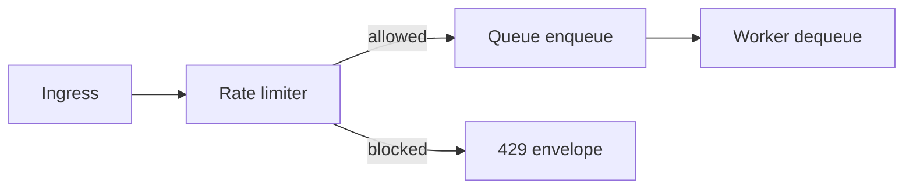

## Queue + Rate Limit Flow

```mermaid
flowchart LR
  A[Ingress] --> B[Rate limiter]
  B -->|allowed| C[Queue enqueue]
  B -->|blocked| D[429 envelope]
  C --> E[Worker dequeue]
```

## Security Caveats

- Enforce tenant-scoped keys and queue names.

## Operational Caveats

- Select algorithm per endpoint: fixed-window, sliding-window, token-bucket.
